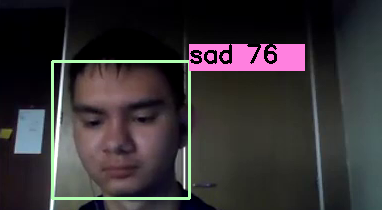

# EdControl

Automated analytics service that tracks students' emotional responses during online classes.

## Problem
На сегодняшний день, существует большое количество платформ для онлайн-обучения. Существуют как крупные онлайн-школы, так и более малые по количеству учащихся. И из-за большого потока клиентов необходимо набирать преподавателей для проведения занятий. И менеджеры не всегда могут понять на сколько преподаватель компетентен в области soft skills при подаче материала. Следовательно, необходимо вовремя определять агрессивных и не умеющих контролировать свои эмоции преподавателей, для сохранения репутации компании. 

Today, there are a large number of platforms for online learning. There are both large online schools and smaller ones in terms of the number of students. And because of the large flow of clients, it is necessary to recruit teachers to conduct classes. And managers can not always understand how much the teacher is competent in the field of soft skills when submitting material. Therefore, it is necessary to identify aggressive and unable to control their emotions teachers in time to preserve the reputation of the company.

## Solving the problem
Наш продукт предлагает решение данной проблемы оценки образования, помогая онлайн платформам экономить время менеджеров при ручном просмотре видео-уроков преподавателей и повышать бизнес метрики компании, выявляя на ранней стадии не компетентных преподавателей. Проблема решается путем распознавания негативных эмоций клиента во время онлайн-урока с преподавателем. Вы загружаете запись видео-урока в наш сервис и получаете dashboard с информацией и аналитикой по всему уроку. Также на данном dash-board, при выявлении каких-либо негативных ситуаций, можно увидеть конкретные timestamp, когда была замечена эмоция и на сколько она велика.

Our product offers a solution to this problem of education assessment, helping online platforms save managers' time when manually viewing teachers' video lessons and improve the company's business metrics by identifying non-competent teachers at an early stage. The problem is solved by recognizing the client's negative emotions during an online lesson with a teacher. You upload a video lesson recording to our service and get a dashboard with information and analytics throughout the lesson. Also on this dashboard, when identifying any negative situations, you can see the specific timestamp when the emotion was noticed and how big it is.

## Implementation
На данный момент реализованы:
- Эмоциональное оценка состояния человека
- Аналитика и визуализация данных для удобного анализа видео-урока
- Рекомендации преподавателю для проведения последующих уроков, при обнаружении каких-либо проблем

Модель с помощью CV определяет эмоцию, которую испытывает человек в данный момент времени и отображает глубину эмоции в шкале от 0 до 100:

Currently implemented:
- Emotional assessment of a person's condition
- Data analytics and visualization for convenient video lesson analysis
- Recommendations to the teacher for subsequent lessons, if any problems are found

The CV model determines the emotion that a person is experiencing at a given time and displays the depth of emotion on a scale from 0 to 100:

<p align="center">



## The appearance of the service
Внешний вид сервиса интуитивно понятен для пользователей и его главная страница выглядит так:

The appearance of the service is intuitive for users and its main page looks like this:
<p align="center"></p>

После успешной обработки загруженного видео вы можете получить аналитику и рекомендации:

After successfully processing the uploaded video, you can get analytics and recommendations:
<p align="center"></p>

## Installation

1\. Install [git](https://git-scm.com/book/en/v2/Getting-Started-Installing-Git) and [docker engine](https://docs.docker.com/engine/install/)

2\. Clone the project:

```bash
git clone https://github.com/Wander1ngW1nd/EdControl
```

3\. Build an image:

```bash
docker build -t edcontrol_image EdControl
```

4\. Run application container:

```bash
docker run --name edcontrol_app -dp 8501 edcontrol_image
```

5\. Figure out which port was assigned to your application:

```bash
docker port edcontrol_app
```
&nbsp; &nbsp; You will see the similar output:

```
8501/tcp -> 0.0.0.0:<your_port_number>
```

6\. Go to:
```
http://0.0.0.0:<your_port_number>
```

Now you can use the app!


## Development

### Dependencies Management

Project’s dependencies are managed by [poetry](https://python-poetry.org/). So, all the dependencies and configuration parameters are listed in [pyproject.toml](pyproject.toml). 

To install the dependencies, follow these steps:

1\. Install [git](https://git-scm.com/book/en/v2/Getting-Started-Installing-Git) and [poetry](https://python-poetry.org/docs/#installation)

2\. Clone the project and go to the corresponding directory: 

```bash
git clone https://github.com/Wander1ngW1nd/EdControl
cd EdControl
```

3\. (Optional) If your python version does not match the requirements specified in [pyproject.toml](pyproject.toml), [install one of the matching versions](https://realpython.com/installing-python)

4\. Create virtual environment and activate it

```bash
poetry shell
```

5\. Install dependencies

```bash
poetry lock --no-update
poetry install
```

## Road Map
На данный момент продукт находится в рабочем состоянии и готов к использованию. Наша команда EdControl видит перспективы и дальнейший путь развития продукта, добавление новых функций и расширение целевой аудитории.

- Вырезание окна с обучающимся
- Добавление распознавания речи (текст) и интонации (аудио) для повышения точности определения эмоционального состояния
- Добавление распознования бан слов и жестов
- Добавление функции идентификации по лицу
- Добавление возможности распознования эмоционального состояния в групповых звонках и конференциях
- Интеграция в LMS системы различных платформ

At the moment, the product is in working condition and ready for use. Our EdControl team sees prospects and the further path of product development, the addition of new features and the expansion of the target audience.

- Cutting out a window with students
- Adding speech recognition (text) and intonation (audio) to improve the accuracy of determining the emotional state
- Adding recognition of ban words and gestures
- Adding face identification function
- Adding the ability to recognize the emotional state in group calls and conferences
- Integration into LMS systems of various platforms